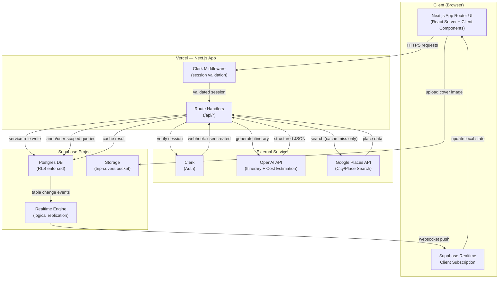

# GlobeTrotter AI — Architecture

**Doc 4 of 9** · Version 2.0

---

## 1. High-Level Architecture Diagram

---

## 2. Component Responsibilities

| Component | Responsibility |
|---|---|
| **Next.js UI** | Renders pages, handles user input, subscribes to Realtime channels for the currently open trip |
| **Clerk Middleware** | Runs on every request to protected routes; validates session, redirects unauthenticated users |
| **Route Handlers (`/api/*`)** | All server-side logic: CRUD on trips/stops/activities, budget calculations, AI generation calls, Clerk webhook receiver |
| **Clerk** | Owns identity — login, signup, session tokens, OAuth. Fires webhooks on user lifecycle events |
| **Supabase Postgres** | System of record for all app data; RLS enforces access control at the data layer, not just the API layer |
| **Supabase Storage** | Holds uploaded cover images, served via public URLs |
| **Supabase Realtime** | Streams Postgres change events (insert/update/delete on `trip_stops`, `activities`) to subscribed clients |
| **OpenAI API** | Generates structured itinerary JSON from user inputs via function-calling; also generates on-demand cost estimates for activities not in cached data |
| **Google Places API** | Provides real, global city/place search results (name, address, coordinates, photos) — called only on a `places_cache` miss |

---

## 3. Request Flow Examples

### 3.1 Creating a Trip
1. User submits Create Trip form (client)
2. `POST /api/trips` Route Handler
3. Handler validates Clerk session → resolves `users.id` from `clerk_id`
4. Handler inserts into `trips` (RLS allows insert since `user_id` matches session)
5. Response returns new trip; client navigates to `/trips/[tripId]`

### 3.2 Live Sync While Editing
1. User A opens `/trips/abc123` → client subscribes to Realtime channel filtered `trip_id=eq.abc123` on `trip_stops` and `activities`
2. User B (same trip, different device) adds a city → `POST /api/trips/abc123/stops`
3. Handler inserts row into `trip_stops`
4. Postgres change event fires → Realtime pushes to all subscribed clients
5. User A's client receives the event, updates local state — new city appears without a page refresh

### 3.3 AI Itinerary Generation (with fallback)
1. Client calls `POST /api/ai/generate-itinerary` with `{ destination, days, budget, interests }`
2. Handler checks `users.ai_generations_today < daily cap`; if exceeded, returns a friendly limit message
3. Handler calls OpenAI with an 8s timeout
4. **Success path**: parses structured JSON, logs to `ai_generation_log` (`used_fallback: false`), returns itinerary
5. **Failure path** (timeout/error/rate-limit): handler selects a matching pre-built template for the destination (or closest match), logs `used_fallback: true`, returns itinerary with a `fallback: true` flag
6. Client renders the itinerary into the builder either way — user never sees a raw error

### 3.4 Dynamic Place Search (e.g., user searches "Tokyo" or "Yekaterinburg, Russia")
1. Client calls `GET /api/places/search?query=Tokyo`
2. Handler checks `places_cache` for a fresh (non-expired) match
3. **Cache hit**: return cached results immediately — no external call, near-instant response
4. **Cache miss**: call Google Places API (Text Search), upsert results into `places_cache`, return them
5. Client renders results — works identically for any city on Earth, no manual data entry required. This is what gives the app the "same as Wanderlog" dynamic feel while keeping API costs near zero after the first search for any given place.

### 3.5 New User Signup
1. User signs up via Clerk
2. Clerk fires `user.created` webhook → `POST /api/webhooks/clerk`
3. Handler verifies svix signature using `CLERK_WEBHOOK_SECRET`
4. Handler upserts into `users` table using `SUPABASE_SERVICE_ROLE_KEY` (no user session exists yet at this point)
5. User is redirected to `/dashboard`, which now finds their synced `users` row

---

## 4. Deployment Topology

- Single Vercel project, `main` branch auto-deploys to production
- Single Supabase project (no separate staging DB for hackathon timeline — acceptable risk given scope; call this out as a "with more time" item in the implementation plan)
- Environment variables managed in Vercel dashboard, pulled locally via `vercel env pull`

---

## 5. Why This Architecture Fits the Constraints

- **No separate backend service** → one deployable unit, simpler for 4+ people to coordinate without a service-boundary contract to maintain mid-hackathon
- **RLS as the security boundary** → even if a Route Handler has a bug, the database itself refuses unauthorized reads/writes — defense in depth with minimal extra code
- **Realtime scoped narrowly** (§3 TRD) → avoids building custom WebSocket infrastructure while still delivering the "live collaboration" differentiator
- **AI fallback baked into the architecture, not bolted on** → the demo's most impressive feature is also its most fragile dependency; the fallback path is a first-class part of the request flow, not an afterthought

---

*Next document: **05-System-Design** — deeper dive on scalability considerations, data flow under load, and edge cases.*
