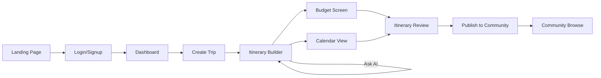

# GlobeTrotter AI — UI/UX Design

**Doc 6 of 9** · Version 2.0

---

## 1. Design Principles

1. **One primary action per screen** — every screen has an obvious next step (Create Trip, Add City, Generate Itinerary), no competing CTAs
2. **Never show a blank/broken state** — empty trips, failed AI calls, and loading states all have designed placeholders (see §6)
3. **Live changes should be visible, not silent** — when Realtime updates the UI, briefly highlight the changed element (a 400ms fade-in background flash) so collaborators visually register "something just changed"
4. **Mobile-usable, not mobile-optimized** — responsive breakpoints matter more than a bespoke mobile layout, per TRD scope

---

## 2. Design System (shadcn/ui base)

| Token | Value | Notes |
|---|---|---|
| Primary color | Deep teal (`#0F766E`) | Evokes travel/ocean without being a cliché "travel blue" |
| Accent | Warm amber (`#F59E0B`) | Used sparingly — CTAs, budget alerts |
| Neutral background | `#FAFAF9` (light) / `#18181B` (dark, stretch goal) | |
| Font | Inter (UI), for headings consider a slightly rounder display font if time permits | System-safe fallback stack |
| Radius | `rounded-xl` (12px) on cards, `rounded-md` on inputs | Consistent softness across the app |
| Spacing scale | Tailwind default (4px base) | Don't invent a custom scale — wastes time |

**Category color coding** (used consistently across activity tags, charts, calendar):
- Adventure — orange
- Food — red
- Nature — green
- Nightlife — purple
- Culture — blue

---

## 3. Screen-by-Screen UX

### 3.1 Landing Page
- Hero: headline + subtext + "Start Planning" CTA above the fold
- Below fold: 3-feature highlight grid (AI generation, Live collaboration, Budget tracking)
- Popular destinations as a horizontally scrollable card row
- Sticky top nav with Login button

### 3.2 Login/Signup
- Clerk's prebuilt `<SignIn />`/`<SignUp />` components, themed to match the design tokens above (Clerk supports appearance overrides — don't hand-build this UI)

### 3.3 Dashboard
- Left: greeting + quick stats (trips planned, countries visited, total budget tracked)
- Main: "Upcoming Trips" cards (cover image, dates, city count, budget bar) and "Recent Activity" below
- Floating/prominent "+ Create Trip" button, always visible

### 3.4 Create Trip (Modal or dedicated page)
- Single-column form: Title → Dates (range picker) → Budget (numeric input with currency symbol) → Cover Image (drag-drop upload, shows preview) → Visibility toggle (Private/Public, defaults Private)
- Submit disabled until required fields valid (title + dates)

### 3.5 Trip Listing
- Toggle: Grid (cards with cover image) / List (compact rows)
- Filter chips: Draft / Active / Completed / All
- Search bar filtering by title

### 3.6 Itinerary Builder — the core screen
**Layout**: two-panel
- **Left panel**: vertical list of city stops (drag handles for reorder), each expandable to show its activities
- **Right panel**: map or route visualization (simple — a vertical connector line with city pins is enough; a real interactive map is a stretch goal, not required)
- **"Ask AI" button** pinned near the top — opens a small form (destination/days/budget/interests pre-filled from trip data where possible) → generates and inserts a draft itinerary the user can then edit
- Presence avatars (small circular avatars, top-right) show who else is viewing/editing live
- Adding an activity: inline "+ Add Activity" under each city → opens a compact form (title, category select with color dot, cost, duration)

### 3.7 Calendar View
- Tab switcher: Month / Week / Day / Timeline
- Timeline view is the most demo-friendly — horizontal bar per day showing city + activity count, click to jump to that day in the builder

### 3.8 Itinerary Review
- Read-only, print/share-friendly layout: day-by-day cards, route summary at top, "Publish to Community" CTA at the bottom

### 3.9 Budget Screen
- Top: three-number summary row — Total Budget / Planned Cost / Remaining (color-coded: green if remaining ≥ 0, red/amber if over)
- Pie chart (Recharts) by category below
- Table of individual `budget_items` with add/delete inline

### 3.10 Community Tab
- Masonry/grid of public trip cards (cover image, title, destination summary, like count)
- Card hover/tap reveals Like / Save / Copy icons
- Clicking a card opens a read-only Itinerary Review view of that trip

### 3.11 Profile
- Simple two-column: avatar + bio/preferences on left, grid of the user's published trips on right

### 3.12 Admin Panel
- Stat cards row (Total Users, Total Trips, Public Trips) + a simple bar chart of most-planned cities
- Table view of recent community activity

---

## 4. Core User Flow (Visual)

---

## 5. Interaction Details Worth Getting Right

- **Drag-reorder**: use a lightweight library (`@dnd-kit/core` pairs well with React 18/Next.js) rather than hand-rolling drag events — this is a common source of janky demo moments if rushed
- **Live sync highlight**: newly-arrived Realtime rows get a brief background color transition (teal-tinted, fading to neutral over 400ms) so the "wow it updated live" moment is visually obvious to judges, not something they might miss
- **AI generation loading state**: don't use a generic spinner — show a short animated sequence of what's happening ("Analyzing destination... Building day plan... Estimating costs...") over the 8s window; makes the wait feel intentional and doubles as a subtle explanation of what the AI is doing

---

## 6. Empty / Loading / Error States (do not skip these)

| State | Design |
|---|---|
| No trips yet (Dashboard) | Illustration + "Plan your first trip" CTA, not a blank grid |
| Itinerary with 0 stops | "Add your first city to get started" inline prompt in the left panel |
| AI generation fails → fallback used | Itinerary still renders, with a small "Generated from template" badge — not an error message |
| Community tab, no public trips yet | "Be the first to share a trip" prompt |
| Network/API error on any action | Toast notification with a retry option, never a blank white screen |

---

*Next document: **07-Backend-Schema-API-Design** — full API route table with request/response shapes.*
