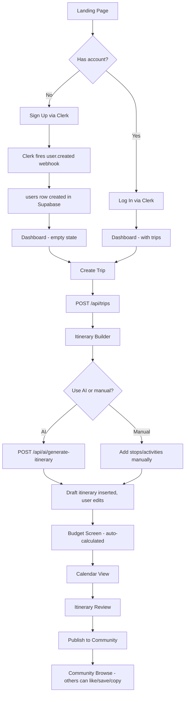
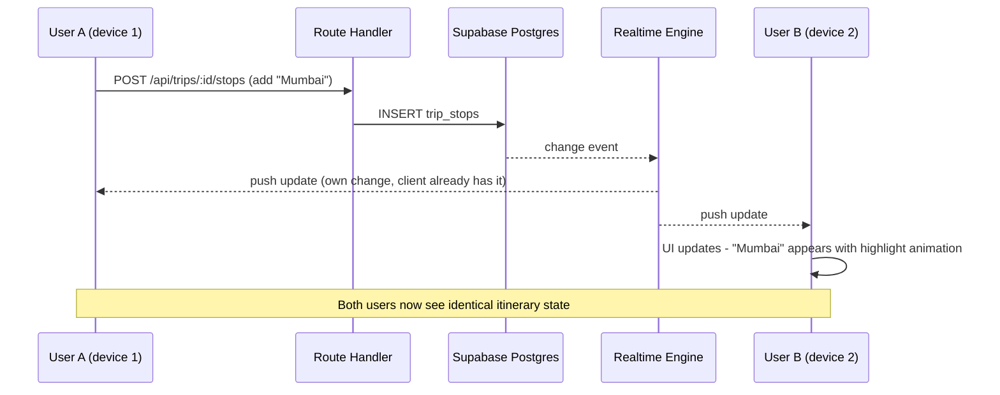
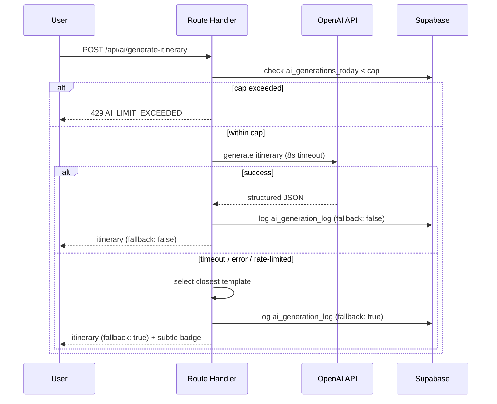
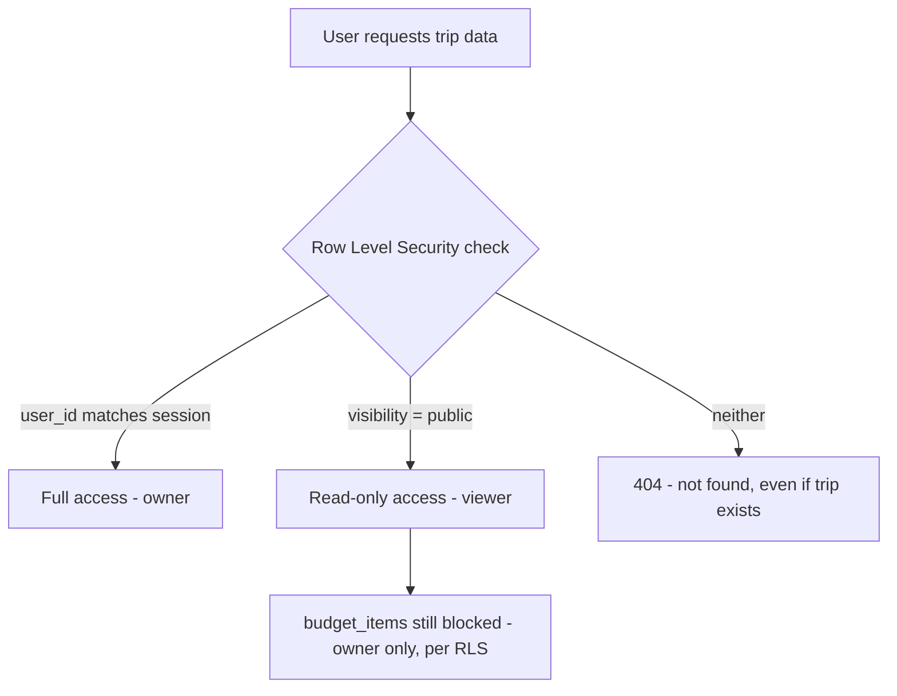
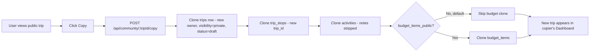
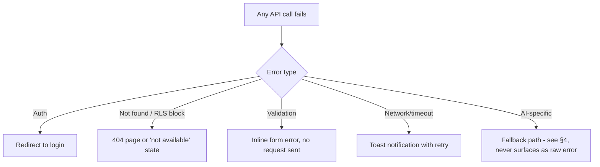

# GlobeTrotter AI — App Flow

**Doc 9 of 9** · Version 2.0

---

## 1. Purpose

This is the consolidated, end-to-end flow reference — what happens, screen by screen and system by system, tying together the PRD (what), UI/UX (how it looks), Architecture (what talks to what), and API design (exact calls). Use this as the single doc to sanity-check the whole system before demo day.

---

## 2. Full New-User Journey

---

## 3. Collaborative Editing Flow (the live-sync differentiator)

---

## 4. AI Generation Flow (with fallback path made explicit)

---

## 5. Trip Visibility & Security Flow

This is the flow worth walking a judge through if asked "is private data actually private?" — the answer is enforced at the database layer (Database Design §4), not just hidden in the UI.

---

## 6. Copy Trip Flow

---

## 7. Error/Failure Flow (applies system-wide)

---

## 8. How the Nine Documents Connect

| Doc | Answers |
|---|---|
| 01 PRD | *What* are we building and *why* |
| 02 TRD | *What tools* and *how is the environment set up* |
| 03 Database Design | *What data* and *how is it protected* |
| 04 Architecture | *What components* and *how do they connect* |
| 05 System Design | *What happens under load/conflict/edge cases* |
| 06 UI/UX | *What does it look like and feel like* |
| 07 Backend/API Design | *Exact contracts* between frontend and backend |
| 08 Implementation Plan | *Who builds what, in what order* |
| 09 App Flow (this doc) | *How it all executes end-to-end* |

---

## 9. Final Pre-Demo Checklist

- [ ] Demo account seeded with a complete, good-looking trip
- [ ] AI fallback tested and confirmed working (force a failure once, verify)
- [ ] RLS tested across two accounts (private trip inaccessible to non-owner)
- [ ] Live sync tested across two real devices, not just two browser tabs on one laptop
- [ ] Demo script (PRD §11) rehearsed at least twice
- [ ] Answers ready for: "What if the AI API is down?", "How do you handle concurrent edits?", "Is data actually private?" — all answered by this doc set

**This completes the 9-document set for GlobeTrotter AI.**
