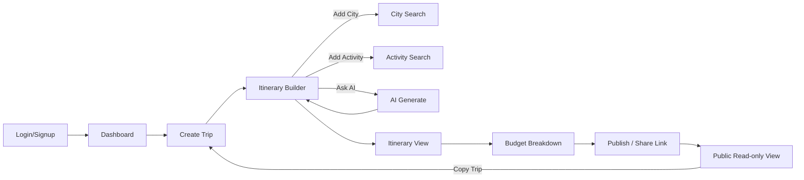
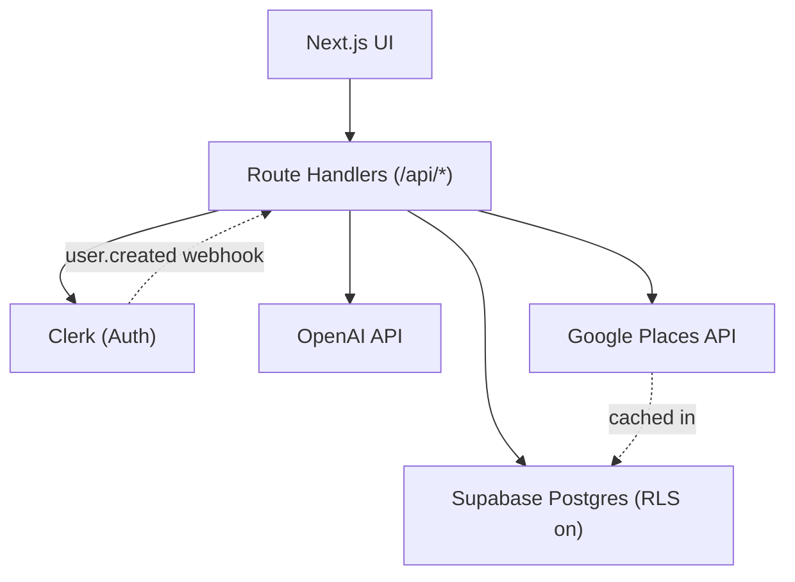
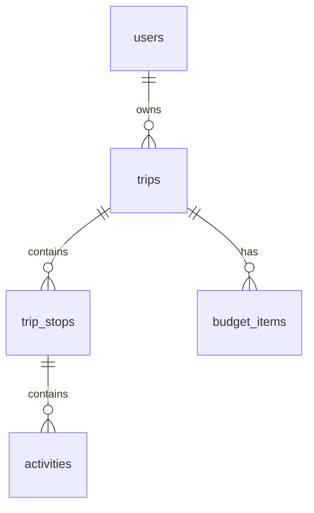

# GlobeTrotter — Hackathon Build Brief

**29-hour sprint · Team of 4 · Consolidated working document**
*(Replaces the 15-separate-document plan — see closing note for why.)*

---

## 1. Problem Breakdown

**Problem**: Multi-city travel planning is fragmented across maps, notes, spreadsheets, and chat apps. Travelers can't easily see the full shape of a trip — dates, cities, activities, and cost — in one place.

**Users**: General travelers planning multi-city trips, solo or in groups, who want a lightweight but structured planning tool.

**Pain points**: No single view of the whole itinerary; budget tracking is manual/error-prone; no easy way to discover activities or share a finished plan.

**Why it matters for this hackathon**: The core loop (build itinerary → see cost → share it) is genuinely demoable in 3 minutes and doesn't require exotic tech — which is exactly what a 29-hour, 4-person, beginner-in-system-design sprint needs.

---

## 2. Product Vision & MVP Scope

**Vision**: A relational-database-backed, multi-city trip planner with AI-assisted itinerary generation and shareable public plans.

**MVP tiers** (this is the single most important section of this doc — refer back to it constantly):

| Tier | Features | Reasoning |
|---|---|---|
| **Must-have (core demo loop)** | Auth, Dashboard, Create Trip, My Trips, Itinerary Builder (add/reorder cities + activities), City Search, Activity Search, Itinerary View (list + calendar toggle), Budget breakdown, AI Itinerary Generator (simplified), Public Share + Copy Trip | Without all of these, the demo has a visible gap. Build in this order. |
| **Should-have (build if Must-have finishes early)** | Admin Dashboard, Profile/Settings | Real value, lower risk, but the demo survives without them |
| **Explicitly cut** | Live/real-time collaborative editing, per-activity AI cost estimation, drag-to-reorder on a separate calendar view (redundant with builder reorder), real social-media share integration (just a copyable link is enough), multi-currency | Each either isn't in the official brief or isn't worth the risk at 29 hours — see Risk Analysis §8 |

**Success metric for the hackathon**: judges can watch one person build a real multi-city trip, generate part of it with AI, see an accurate budget, and share it — without hitting an error state.

---

## 3. User Flow

**Edge cases to explicitly handle** (don't skip — these are what break live demos):
- Trip with 0 stops → Budget shows ₹0, not a crash
- AI generation fails/times out → fallback template renders, never a raw error
- User tries to view a private trip they don't own → clean "not found," not a crash or data leak
- Deleting a city removes its activities too (cascade)

**Failure scenario to rehearse**: wifi drops mid-demo → have a pre-seeded demo account with a complete trip ready as backup, don't rely on live AI generation during the actual judged demo.

---

## 4. PRD Essentials

**Goals**: Working multi-city planner, AI-assisted generation, accurate budget, shareable trips — all demoable in ~3 minutes.

**Non-functional requirements**:
- Responsive down to mobile widths (375px+)
- Private trip data genuinely inaccessible to other users (enforced at the DB level, not just hidden in UI)
- AI feature must degrade gracefully, never crash the demo
- No payment/booking — costs are estimates only, stated clearly in the UI

**Constraints**: 29 hours, 4 people, team is new to backend/system design — favor managed services (auth, DB, hosting) over building infrastructure from scratch.

**Sample user stories** (write more as you build, keep them one-line):
- *As a traveler, I can add cities to my trip and reorder them, so the itinerary reflects my actual route.*
- *As a traveler, I can generate a draft itinerary with AI so I don't start from a blank page.*
- *As a traveler, I can see my planned cost vs. budget so I know if I'm overspending.*
- *As a traveler, I can share a public link to my trip so friends can view or copy it.*

---

## 5. TRD Essentials — Tech Stack

| Layer | Choice | Why (beginner-friendly reasoning) |
|---|---|---|
| Frontend | Next.js (App Router) + TypeScript + Tailwind + shadcn/ui | One framework does both frontend and API — less to coordinate across 4 people |
| Auth | Clerk | Prebuilt login/signup UI — you will not have time to build password reset flows from scratch |
| Database | Supabase (Postgres) | Relational DB + built-in Row Level Security (RLS) — the RLS is what makes "private trips are actually private" true, not just a UI toggle |
| AI | OpenAI API | Function-calling for structured itinerary JSON |
| Place data | Google Places API, cached in your own DB | Works for any city globally, no manual data entry needed |
| Charts | Recharts | Simple, works cleanly in React |
| Deploy | Vercel | Push to deploy, zero config for Next.js |

**Security requirement (non-negotiable, low effort, high payoff)**: enable Row Level Security on every table from your very first migration. Retrofitting RLS after tables are full of data is much more error-prone than starting with it on.

---

## 6. Architecture (High-Level)

**Data flow, plain English**: Browser talks only to your Next.js app. Your app talks to Clerk (who's logged in), Supabase (all trip data, protected by RLS), OpenAI (itinerary generation), and Google Places (city/activity search, cached so you don't re-call it for the same place twice).

---

## 7. Database Design

| Table | Key columns |
|---|---|
| `users` | id, clerk_id, email, name, role |
| `trips` | id, user_id, title, start_date, end_date, budget_total, visibility (private/public), status |
| `trip_stops` | id, trip_id, city, arrival_date, departure_date, **order_index** |
| `activities` | id, stop_id, title, category, cost, duration_minutes, **order_index** |
| `budget_items` | id, trip_id, category, label, amount |
| `places_cache` | google_place_id, name, address, lat/lng, photo_url, expires_at |

**RLS in one sentence**: every table's policy checks `trips.user_id = current session's user` for private data, and allows read-only access when `trips.visibility = 'public'`.

**Budget formula**: `Planned Cost = sum(activity costs) + sum(budget_items)`, `Remaining = budget_total − Planned Cost`.

---

## 8. API Design (Condensed — not full OpenAPI, by design, given the timeline)

| Endpoint | Method | Purpose | Auth |
|---|---|---|---|
| `/api/webhooks/clerk` | POST | Sync new user into `users` table | Webhook signature |
| `/api/trips` | GET/POST | List / create trips | Required |
| `/api/trips/:id` | GET/PATCH/DELETE | Trip detail, edit, delete | Required (owner) |
| `/api/trips/:id/stops` | POST | Add city stop | Required (owner) |
| `/api/trips/:id/stops/reorder` | PATCH | Full resequence of stop order | Required (owner) |
| `/api/trips/:id/stops/:stopId/activities` | POST | Add activity | Required (owner) |
| `/api/trips/:id/budget` | GET | Budget summary + breakdown | Required (owner) |
| `/api/places/search` | GET | City/place search (cache-first) | Required |
| `/api/ai/generate-itinerary` | POST | AI draft itinerary (with fallback) | Required |
| `/api/community/:tripId/copy` | POST | Clone a public trip | Required |
| `/api/public/trips/:tripId` | GET | Public read-only trip view | None |
| `/api/admin/stats` | GET | Usage stats | Required (admin role) |

Each returns `{ data: ... }` on success, `{ error, code }` on failure. Full request/response body shapes: build these inline in code comments as you implement each route — writing a separate full OpenAPI doc for ~12 endpoints is not the best use of your remaining hours, but do keep the shapes consistent with what's listed above.

---

## 9. Hour-by-Hour Implementation Plan (29 hours, 4 people)

Roles: **A** = Backend/DB Lead · **B** = AI/Integration Lead · **C** = Frontend Lead (core flows) · **D** = Frontend Lead (budget/share/admin)

| Hours | A (Backend/DB) | B (AI/Integration) | C (Frontend core) | D (Frontend budget/admin) |
|---|---|---|---|---|
| 0–2 | Repo, Supabase project, RLS-on migrations | Get OpenAI + Google Places keys, test basic calls | Next.js scaffold, Tailwind/shadcn setup | Pair with C on scaffold |
| 2–6 | Clerk webhook → `users` sync, `/api/trips` CRUD | Design AI prompt + function-calling schema, build 3–5 fallback templates | Auth pages, Dashboard, Create Trip form | Trip Listing UI |
| 6–10 | `trip_stops`/`activities` endpoints + reorder | `/api/places/search` + cache table | Itinerary Builder UI (add/reorder cities) | Continue Trip Listing → start Budget UI shell |
| 10–14 | `/api/trips/:id/budget` logic | `/api/ai/generate-itinerary` incl. 8s timeout + fallback | Activity add/remove UI, wire to City/Activity search | Budget charts (Recharts) wired to real endpoint |
| 14–18 | Public share endpoint + `visibility` handling | Wire AI "Generate" button into Builder UI, test fallback deliberately | Itinerary View (list + calendar toggle) | Public share page + Copy Trip flow |
| 18–22 | **Checkpoint: core loop must work end-to-end now** — help wherever's behind | Same | Same | Admin dashboard (if on schedule) |
| 22–26 | Bug fixing, RLS testing across 2 accounts | AI fallback re-test, error states | Empty/loading/error states pass | Profile page, polish |
| 26–28 | Seed demo account with a complete trip | Demo script rehearsal | Same | Same |
| 28–29 | Buffer / final fixes | Buffer | Buffer | Buffer |

**Hard checkpoint at hour 18**: if the core loop (create trip → build itinerary → see budget → share) isn't working end-to-end by then, stop building new features and fix what exists. This is the single most important discipline for a 29-hour sprint.

---

## 10. MVP Strategy — What to Fake, What to Hardcode

- **Fake**: real-time "popular destinations" — hardcode 5-6 nice-looking cities on the landing page/dashboard, don't compute this from real usage data
- **Hardcode**: the 5 AI fallback itinerary templates — write these by hand in advance, don't generate them dynamically
- **Fake**: admin analytics beyond simple counts — `SELECT count(*)` queries are enough, no need for real engagement scoring
- **What creates maximum demo impact**: the AI generation moment (live, in front of judges) and the budget chart updating in real time as activities are added — lead your demo with these two
- **What to build first regardless of team**: Trip → Stop → Activity → Budget is the backbone; nothing else matters if this doesn't work

---

## 11. Risk Analysis

| Risk | Type | Mitigation |
|---|---|---|
| OpenAI rate-limited or down during judging | Technical | Fallback templates (already planned) — test this deliberately before demo, don't assume it works |
| RLS misconfigured, private trip data leaks | Technical | Manual cross-account test in hour 22-26 block — non-negotiable |
| Team runs out of time before Admin panel | Product | It's tier 2 — acceptable to cut live if behind at hour 18 checkpoint |
| Live demo wifi fails | Demo | Pre-seeded backup account, don't depend on live AI call during actual judged demo |
| Scope creep mid-sprint ("let's also add...") | Product | Hard rule: nothing new after hour 18 checkpoint, full stop |
| One team member falls behind/blocked | Technical | Checkpoint at hour 18 is also a "redistribute work" moment — don't wait until hour 26 to notice |

---

## 12. Why One Document Instead of Fifteen

Your own stated priority order was Hackathon Success → Development Speed → Demo Impact → Reliability → Scalability. Fifteen documents at Staff-Engineer depth (full OpenAPI specs, low-level class diagrams, tradeoff essays per decision) optimizes for documentation completeness and production handoff quality — which matters a lot in a real job, and much less in 29 hours. This document keeps every decision and every reason behind it, just compressed to what you'll actually re-read *during* the sprint. The earlier 9 detailed documents from this conversation are still available if anyone wants to go deeper on a specific area (e.g., the full RLS policy SQL, or the complete API request/response bodies) — treat those as reference, this one as your working plan.
